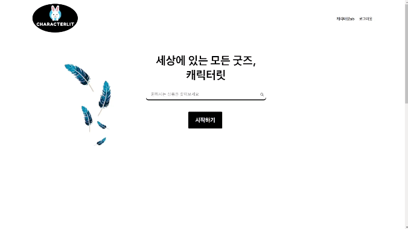

<p align="center">

</p>

# 📕 목차 
## 1. [**서비스 소개**](#1)
## 2. [**기술 스택**](#2)
## 3. [**시스템 아키텍처**](#3)
## 4. [**주요 기능**](#4)
## 5. [**팀원 소개**](#5)
## 6. [**설계 문서**](#6)

<br />
<br />
<br />


<div id="1"></div>

# 🔍 서비스 소개

## 세상의 모든 굿즈, 캐릭터릿
> 점점 커지는 캐릭터 시장과 리셀시장  
전문 거래 플랫폼 없이 거래되는 캐릭터 굿즈들의 가격은  
부르는게 값일 정도로 불안정합니다.  
하지만 캐릭터 굿즈 거래 전문 플랫폼인 캐릭터릿의 경매시스템을 이용한다면  
원하는 물건들을 원하는 가격에 구매하는 것이 가능해집니다  
>
#### 당신이 원하는 캐릭터 굿즈, 캐릭터릿에서 찾아보세요


<br />
<br />
<br />


<div id="2"></div>

# 💻 기술 스택

## Front-end
- HTML5
- CSS3
- JavaScript
- VUE
- Pinia
- VScode
- WebRTC
<br />
<br />

## Back-end
- Java
- Spring
- JPA
- RabbitMQ
- Gradle
- MYSQL
- Python
- WebRTC
- Intellij
<br />
<br />

## Infra
- AWS EC2
- Nginx
- Docker

## Cloud
- AWS S3
- AWS Lambda
<br />
<br />

## Cooperation tool
- Jira
- GitLab
- Notion
- Mattermost
<br />
<br />
<br />
<br />
<br />

<div id="3"></div>

# 🧮 시스템 아키텍처


<br />
<br />
<br />


<div id="4"></div>

# 🙌 주요 기능
<br />
<br />

## ❤ 메인페이지


<br />

- 검색창과 전체 상품목록을 볼 수 있는 페이지로 이동하는 버튼이 있습니다
- 스크롤을 내리면 현재 인기 상품 순위를 보여줍니다 

<br />
<br />
<br />

## 🤝 회원가입 및 로그인페이지


<br />

- Spring Security를 활용하여 로그인 기능을 구현했습니다
- 네이버, 카카오 두 가지 방법으로 소셜 로그인과 회원가입이 가능합니다
- 가입 완료시 최초 유저 닉네임은 유저 번호를 기반으로 생성이 되고 추후 수정 가능합니다
- 완료되면 메인페이지로 넘어가게 됩니다

<br />
<br />
<br />

## 🌏 경매상품페이지


<br />

- 전체 경매 상품리스트를 카드형식으로 보여줍니다
- 썸네일은 Lambda를 활용하여 이미지를 리사이즈한 url을 활용합니다
- 검색 기능을 제공합니다
- 카테고리별 필터링과 생성순으로 정렬이 가능합니다

<br />
<br />
<br />

## ✍ 상품 등록

<br />

<br />


- 상품 기본 정보를 입력합니다
- 경매 시작일과 종료일은 정각으로 설정 가능합니다
- 이미지는 최대 5장까지 업로드 가능합니다
- 썸네일은 따로 업로드 합니다
<br />
<br />
<br />

## ✍ 상품 수정

<br />

<br />

- 상품 기본 정보를 수정합니다
- 경매 시작일과 종료일은 정각으로 설정 가능합니다
- 이미지는 최대 5장까지 업로드 가능합니다
- 썸네일은 따로 업로드 합니다
- 경매 시작 전에만 수정과 삭제가 가능합니다
<br />
<br />
<br />

## 🎁 상품 상세정보(경매)

<br />


<br />

- 상품의 상세 정보를 보여줍니다
- 설정해둔 경매 시작 이후에 입찰 가능합니다
- 최초 입찰은 시작가보다 높은 금액부터 가능합니다
- SSE를 활용하여 실시간으로 입찰가를 갱신합니다
- RabbitMQ를 활용하여 입찰요청을 순차적으로 처리합니다
- 최고 입찰자는 바로 재입찰은 불가능합니다
- 문의하기 버튼을 눌러 판매자와 1대1 채팅이 가능합니다
<br />
<br />
<br />

## 🗣 채팅


<br />

- WebSocket을 활용하여 채팅기능을 구현했습니다
- 채팅목록을 확인할 수 있습니다
- 판매자와 1대1 채팅이 가능합니다
<br />
<br />
<br />

## 🤭 마이페이지


<br />

- 내 정보를 수정할 수 있습니다
- 내 판매목록을 보여줍니다
- 내 입찰목록을 보여줍니다
- 내 페이내역을 보여줍니다
- 포인트 조회 및 충전, 출금이 가능합니다
<br />
<br />
<br />

## 💎 페이(캐릿페이)

<br />

- 계좌이체와 카카오페이를 통해 포인트를 충전할 수 있습니다
- 포인트를 현금화해 등록된 계좌로 인출할 수 있습니다
- 거래 후 8일차부터 인출 가능합니다
<br />
<br />
<br />


<br />
<br />
<br />


<div id="5"></div>

# 👫 팀원 소개 및 프로젝트 기간

<table>
    <tr>
        <td height="140px" align="center"> 
             <br><br> 👑 최홍준 <br>(Full-Stack) </a> <br></td>
        <td height="140px" align="center"> 
             <br><br> 🙂 김상민 <br>(Full-Stack) </a> <br></td>
        <td height="140px" align="center"> 
             <br><br> 😎 천우진 <br>(Infra) </a> <br></td>
        <td height="140px" align="center"> 
             <br><br> 😁 김보라 <br>(Full-Stack) </a> <br></td>
        <td height="140px" align="center"> 
             <br><br> 🙄 이아진 <br>(Full-Stack) </a> <br></td>
        <td height="140px" align="center"> 
             <br><br> 😉 권근열 <br>(Full-Stack) </a> <br></td>         
    </tr>
    <tr>
        <td align="center">경매-통신<br/></td>
        <td align="center">인증/인가, 유저관리<br/></td>
        <td align="center">서버 배포<br/></td>
        <td align="center">페이<br/></td>
        <td align="center">채팅<br/></td>       
        <td align="center">경매<br/></td>    
    </tr>
</table>


### 👫 team vamos : 24.2.19 ~ 24.04.04

<br />
<br />
<br />

<div id="6"></div>

# 📃 설계 문서

## ERD


<br />
<br />
<br />

## 시퀀스다이어그램 (경매입찰관련)


<br />
<br />
<br />

## 플로우차트 (경매입찰관련)


<br />
<br />
<br />

## Git convention

```
기본적으로 커밋 메시지는 **제목**로 구성합니다.

각 파트는 아래와 같은 형태로 빈줄 하나를 두고 구분을 시켜주면됩니다.

- tag: 어떤 의도로 커밋했는지를 type 에 명시 (ex. feat, fix, docs)
- Subject : **제목**. 코드 변경사항에 대한 짧은 요약을 나타냅니다.
1. **타입(Commit Type)**
    
    커밋메시지는 아래와 같은 규약을 지키면서 작성해주시면 됩니다.
    
    1. 타입은**" 태그(tag) + 제목(subject) " 으로 구성**되며, 태그는 영어로 쓰되, **첫 문자는 대문자** 로 합니다.
    2. "[태그] 제목" 의 형태이며, [태그] 뒤에 space 가 있음에 유의합니다.
    3. ex) `[Feat] 결제 api 작성` (Feat 가 태그이고, 결제 api 작성이 제목입니다.)
2. **제목(Subject)**
    
    제목은 코드의 변경 사항에 대해 짧은 요약을 나타냅니다. 아래와 같은 규칙을 지켜주도록 합시다.
    
    **한글로 제목을 작성하는 경우**
    
    "고침", "추가", "변경" 등의 **명령조** 로 시작합니다. ex) `[Feat] 추가 get data api 함수`
```

```

📋 **커밋 태그 종류**

- **Feat** : 새로운 기능을 추가하는 경우
- **Fix** : 버그를 고친경우
- **Docs** : 문서를 수정한 경우
- **Style** : 코드 포맷 변경, 세미콜론 누락, 코드 수정이 없는경우
- **Refactor** : 코드 리펙토링
- **Test** : 테스트 코드. 리펙토링 테스트 코드를 추가했을 때
- **Chore** : 빌드 업무 수정, 패키지 매니저 수정
- **Design** : CSS 등 사용자가 UI 디자인을 변경했을 때
- **Rename** : 파일명(or 폴더명) 을 수정한 경우
- **Remove** : 코드(파일) 의 삭제가 있을 때. "Clean", "Eliminate" 를 사용하기도 함
- **Add** : 코드나 테스트, 예제, 문서등의 추가 생성이 있는경우
- **Improve** : 향상이 있는 경우. 호환성, 검증 기능, 접근성 등이 될수 있습니다.
- **Implement** : 코드가 추가된 정도보다 더 주목할만한 구현체를 완성시켰을 때
- **Move** : 코드의 이동이 있는경우
- **Updated** : 계정이나 버전 업데이트가 있을 때 사용. 주로 코드보다는 문서나, 리소스,         라이브러리등에 사용합니다.
- **Comment** : 필요한 주석 추가 및 변경

```
<br />
<br />
<br />
